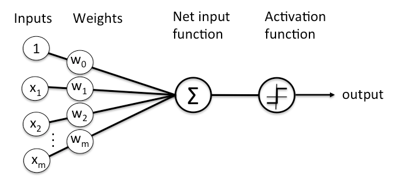
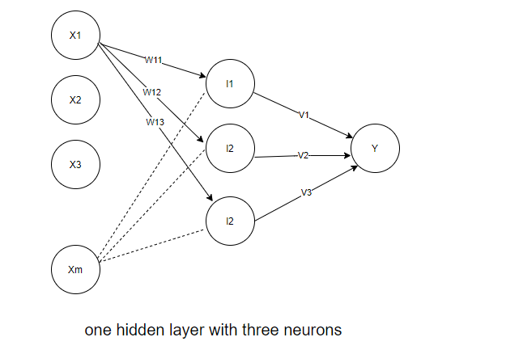
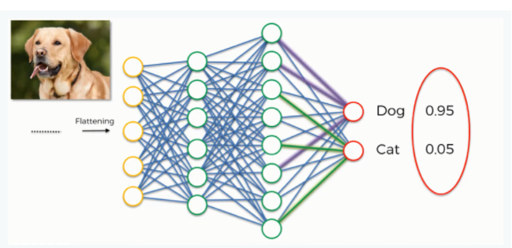
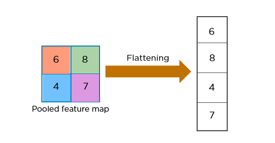
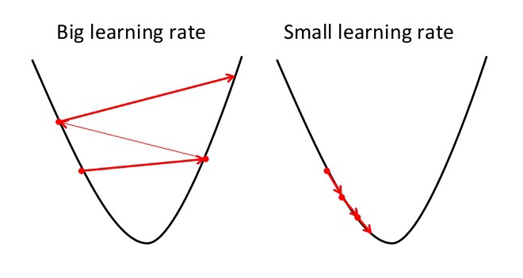
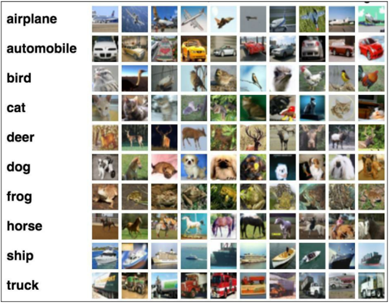

# Images Classification with CNN #

The code of this nootbook is referenced from https://www.kaggle.com/roblexnana/cifar10-with-cnn-for-beginer
    
### Image classification ###
Image classification is the process of taking an input (like a picture) and outputting a class (like “cat”) or a probability that the input is a particular class (“there’s a 90% probability that this input is a cat”). Neural nets have proven to be very efficient as regards image classification.  

### Deep-learning ###  
Deep-learning is a very trendy term. The main reason is that related techniques have recently shown incredible ability to produce really good, if not state of the art, results on various kind of problems, ranging from image recognition to text translation. Standing in front of this growing technology, made possible by the increase of data and computer power available, it can be sometimes difficult for non-initiated people to really know “what happens behind the scene”. What is Deep-learning? How do neural networks work?  

### Linear regression ###  
Linear regression is a method for modeling the relationship between independent variables and a dependent variable.  

$Y = w_0 + w_1X_1 + w_2X_2 + ... + w_nX_n$  
where $Y$ is dependent variable, $w_0$ to $w_n$ are equation parameters for linear relation and $X_1$ to $X_n$ are independent variables.  

Assume $X_1$,$X_2$,......$X_n$ are an image's pixel with value between 0~255, and the $Y$ is the image's class with One-Hot encoding  
1    0          0   =  $w_0$ + 1x$w_1$ + 25x$w_2$ + 0x$w_3$ +  ...... + 254x$w_n$  
0    1          0   =  $w_0$ + 6x$w_1$ + 16x$w_2$ + 2x$w_3$ +  ...... + 132x$w_n$  
0    1          0   =  $w_0$ + 3x$w_1$ + 33x$w_2$ + 6x$w_3$ +  ...... + 107x$w_n$  
.......  
0    0          1   =  $w_0$ + 9x$w_1$ + 43x$w_2$ + 9x$w_3$ +  ...... + 101x$w_n$   

There are many ways to solve this equation, for instance we can use least squares method to find regression coefficients $w_0$,$w_1$,...,$w_n$.  

### Neural network ###
The linear regression model is easy to understand, but it has a big drawback: there is no non-linearity! In order to introduce a non-linearity, let us make a little modification in the previous model and suggest the following one.   

$Y = a(w_0 + w_1X_1 + w_2X_2 + ... + w_mX_m)$   

where $a(.)$ is a function called “activation function” which is non-linear. $w_0$ is bias. Now $Y$ is no longer linear.   
  
    
Now, let's build several such features in the same way, but possibly with different weights and different activation functions  
$l_1 = a_{11}(w_{10} + w_{11}X_1 + w_{12}X_2 + ... + w_{1n}X_n)$   
$l_2 = a_{12}(w_{20} + w_{21}X_1 + w_{22}X_2 + ... + w_{2n}X_n)$   
$l_3 = a_{13}(w_{30} + w_{31}X_1 + w_{32}X_2 + ... + w_{3n}X_n)$   

If we aggregate all the pieces, we then get:  
$Y = a_2(v_1l_1 + v_2l_2 + v_3l_3)$  

This last model is a basic feedforward neural network with n entries $(X_1,X_2,...,X_n)$, 1 hidden layer with 3 hidden neurones (whose outputs are $l_1$, $l_2$ and $l_3$) and 1 final output.  

  

We could have decided to add another intermediate “hidden” layer between the l’s and the final output exactly in the same way as we just add these l’s between the input and the output : then we would have had a neural network with 2 hidden layers. Or we could have chosen to stay with 1 hidden layer but to have more neurones in it (5 instead of 3, for example).  
    
### Convolutional neural networks ###
The convolutional neural network (CNN) is a class of deep learning neural networks. CNNs represent a huge breakthrough in image recognition. 

A CNN works by extracting features from images. This eliminates the need for manual feature extraction. The features are not trained! They’re learned while the network trains on a set of images. This makes deep learning models extremely accurate for computer vision tasks. CNNs learn feature detection through tens or hundreds of hidden layers. Each layer increases the complexity of the learned features.  
    
* starts with an input image  
* applies many different filters to it to create a feature map
* applies a ReLU function to increase non-linearity
* applies a pooling layer to each feature map
* flattens the pooled images into one long vector.
* inputs the vector into a fully connected artificial neural network.
* processes the features through the network. The final fully connected layer provides the “voting” of the classes that we’re after.
* trains through forward propagation and backpropagation for many, many epochs. This repeats until we have a well-defined neural network with trained weights and feature detectors.

  

### Features ###
A convolutional layer that extracts features from a source image. Convolution helps with blurring, sharpening, edge detection, noise reduction, or other operations that can help the machine to learn specific characteristics of an image.  

Feature detectors can be set up with different values to get different results. For example, a filter can be applied that can sharpen and focus an image or blur an image. That would give equal importance to all the values. You can do edge enhancement, edge detection, and more. You would do that by applying different feature detectors to create different feature maps. The computer is able to determine which filters make the most sense and apply them.

Feature is smaller than the original input image. This makes it easier and faster to deal with. Do we lose information? Some, yes. But at the same time, the purpose of the feature detector is to detect features, which is exactly what this does.


### ReLu (Rectified Linear Unit) 
In this step we apply the rectifier function to increase non-linearity in the CNN. Images are made of different objects that are not linear to each other. Without applying this function the image classification will be treated as a linear problem while it is actually a non-linear one.


### Polling
You want lots of pictures of the same thing so that your network can recognize an object in all the images. No matter what the size or location. No matter what the lighting or the number of spots, or whether that leopard is fast asleep or crushing prey. You want spatial variance! You want flexibility. That’s what pooling is all about.

The most common example of pooling is max pooling. In max pooling, the input image is partitioned into a set of areas that don’t overlap. The outputs of each area are the maximum value in each area. This makes a smaller size with fewer parameters.
Max pooling is all about grabbing the maximum value at each spot in the image. This gets rid of 75% of the information that is not the feature.  

  

### Flatten    
In between the convolutional layer and the fully connected layer, there is a ‘Flatten’ layer. Flattening transforms a two-dimensional matrix of features into a vector that can be fed into a fully connected neural network classifier.   


### Dense ###  
A fully connected layer also known as the dense layer, in which the results of the convolutional layers are fed through one or more neural layers to generate a prediction.  

The first parameter is output_dim which is the number of nodes in the hidden layer. You can determine the most appropriate number through experimentation. The higher the number of dimensions the more computing resources you will need to fit the model. A common practice is to pick the number of nodes in powers of two. The second parameter is the activation function. We usually use the ReLu activation function in the hidden layer.

``` model.add(Dense(output_dim = 128, activation=’relu’)) ```

### Learning Rate ###  
It is responsible for the core learning characteristic and must be chosen in such a way that it is not too high wherein we are unable to converge to minima and not too low such that we are unable to speed up the learning process. Recommended to try in powers of 10, specifically 0.001,0.01, 0.1,1.  
  

### Batch Size ###
The number of examples from the training dataset used in the estimate of the error gradient is called the batch size and is an important hyperparameter that influences the dynamics of the learning algorithm.  

It is indicative of number of patterns shown to the network before the weight matrix is updated. If batch size is less, patterns would be less repeating and hence the weights would be all over the place and convergence would become difficult. If batch size is high learning would become slow as only after many iterations will the batch size change. It is recommend to try out batch sizes in powers of 2 (for better memory optimization) based on the data-size.  
    
### Example of calculating the shape size ###  
  
**f**: filter dimission  
**s**: stride length  
shape formula: ceil(N+f-1)/s)  
**784**:   28 x 28 x 1 = 784    
**6,272**: (28,28,1)x8 = (28,28,8) = 28x28x8 = 6,272  
**1,568**: ceil((28–2+1)/2)=ceil(13.5)=14; (14,14,8) = 14 x 14 x 8 = 1568  
**1,600**: cell((14–5+1)/1)=10; (10,10,16)=10 x 10 x 16 = 1600  
**64**:    Dense Activation shape (64,1) states 64 hidden units are used in the dense layer  


### data set ###

The CIFAR-10 data consists of 60,000 32x32 color images in 10 classes, with 6000 images per class. There are 50,000 training images and 10,000 test images in the official data. We have preserved the train/test split from the original dataset.  The provided files are:
train.7z - a folder containing the training images - 107 MB
test.7z - a folder containing the test images - 624 MB
trainLabels.csv - the training labels   576 KB